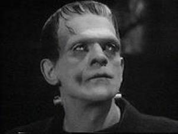
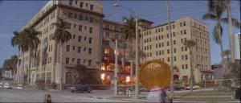
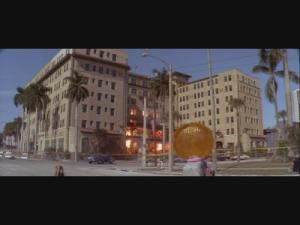
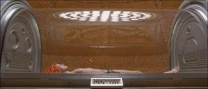
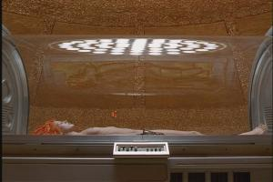

16:9, Letterbox, Widescreen, Anamorph, 16:9 optimalisert, Pan & Scan? Det finnes en rekke betegnelser som beskriver bildet på en film. Her i Hjemmekino.no's bildeformat guide finner du forklaring på de fleste.

I første del av guiden vil du få en forklaring på hvorfor filmen virker så mye bredere på kino enn på et vanlig TV-apparat. Du vil også få forklart de forskjellige teknikkene som brukes for å tilpasse filmen til TV-ruta. I andre del vil du få forklart uttrykket 16:9 optimaliserte (Anamorphic) DVD filmer, og hvorfor det er en stor fordel for bildekvaliteten. I siste del vil du finne en oversikt over de forskjellige bildeformatene.

## Hvorfor widescreen?

I 1930-årene ble det bestemt at formatet på kinofilmer skulle være 1.33:1 eller 4:3. Bildet skulle altså være 4 enheter bredde for 3 enheter høyde. Denne standarden ble kjent som "Academy Standard". Dette er også samme format som et vanlig TV-apparat har. Når så filmer skulle vises på TV-apparatet var det ingen problemer, for filmen passet perfekt til TV-ruta.

  
  
Frankenstein (1931) i 1.33:1 format - et eksempel på klassisk Academy Standard

Men når salget av TV-apparater økte sterkt i 1950-årene, og flere valgte å se filmene hjemme i sin egen stue, skapte dette bekymring hos filmselskapene. Noe måtte gjøres for å opprettholde kinobesøkene.

Hollywood begynte dermed å eksperimentere med 3D film og widescreen formater. 3D ble en flopp, men widescreen formatet var kommet for å bli. I 1953 introduserte 20th Century Fox CinemaScope, et format som ble brukt av flere studioer mellom 1953 og 1967. I 1953 ble det laget fem filmer i widescreen format, året etter 40 og i 1955 over 100. I dag dominerer widescreen filmer totalt over verdens filmproduksjon. I dag er det to standardiserte formater som er 1.85:1 og 2.35:1. Oversikt finner du i siste del av guiden.

Det er ingen tvil om at widescreen film gir en mye større filmopplevelse for seeren. I tillegg er den menneskelige synsvinkelen mer tilpasset dette formatet.

Men hvordan kan man se widescreen film på et vanlig TV-apparat? Jo, det finnes 3 teknikker som er brukt. Hvilken teknikk som blir brukt er litt avhengig av hvilken filmformat filmen egentlig er spilt inn på.

## Metode 1: Pan & Scan

Pan & Scan er klart den dårligste metoden for å vise widescreen film på et vanlig TV-apparat. Dette er en teknikk hvor du kan miste opptil 40% av bildeinformasjonen i overføringen fra widescreen format til TV-format.

Filmselskapene kutter bildet på sidene slik at filmen passer til den bortimot kvadratiske TV-skjermen. Verst blir det når filmen originalt er innspilt med det bredeste formatet. Da går man nemlig glipp av 40% av bildet.

Da mister man kinofølelsen og viktig informasjon kan falle bort. Filmversjoner som er kuttet på sidene for å tilpasse TV skjermen, kalles for Pan & Scan versjon. Sammenlign bildene under som viser forskjellen mellom Pan & Scan og originalt format slik den blir vist på kino, og se selv hvorfor denne teknikken ikke er ønskelig. Denne scenen er hentet fra DVD versjonen.

  

    
    
PAN & SCAN - 40% av bildet er kuttet bort

  

  

    
    
Originalt format - komplett bilde som regissøren tenkte

  

## Metode 2: Letterbox

Filmer kan bli vist i originalt format på 4:3 TV. Men da vil det komme svarte områder oppe og nede på bildet. Flere og flere filmer blir vist slikt. Mange liker ikke å ha disse svarte områdene på bildet. Dette er som regel fordi de ikke vet hva de går glipp av ved Pan & Scan.

Ulempen med Letterbox er at mye av TV-systemets linjer blir brukt til å vise svarte områder over og under filmen. Dette er sløsing med bildekvalitet. Løsningen på dette er 16:9 optimalisert (Anamorph) bilde som brukes på mange DVD utgivelser. Dette kan du lese om i del 2 av denne guiden.

  
  
Letterbox visning av Lethal Weapon 3 - svarte områder oppe og nede

## Metode 3: Super 35 full frame

Det finnes en tredje metode som blir brukt på filmer spilt inn på en filmtype som heter Super 35. Denne filmtypen har 4:3 format. På kinoversjonen blir ikke alt som blir filmet vist, det blir nemlig tilpasset f.eks. 2.35:1. Dette er blant annet en filmtype som James Cameron sverger til, og blant annet filmer som "Titanic", "Terminator 2", "The Abyss" og "True Lies" er filmet med denne typen film.

Nedenfor ser du et eksempel fra "The Fifth Element" DVD utgivelse som viser forskjellen mellom kinoversjonen og full frame versjonen.

  

    
    
Super 35 i 2.35:1 format (kinoversjonen)

  

  

    
    
Super 35 i 4:3 format (full frame med mer høydeinformasjon)

  

Du ser tydelig at på full frame versjonen er det mer informasjon i høyden enn det som er med i kinoversjonen av filmen.